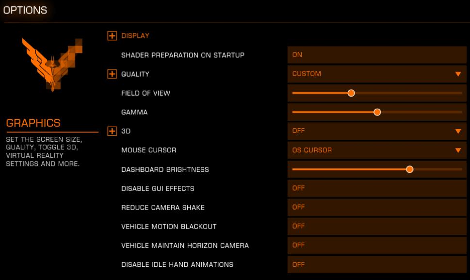
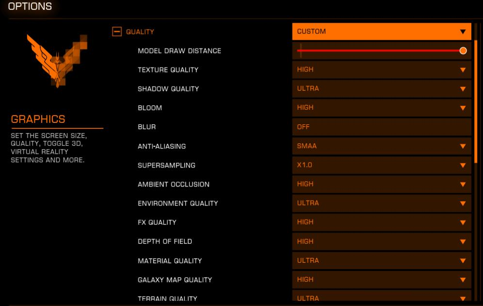
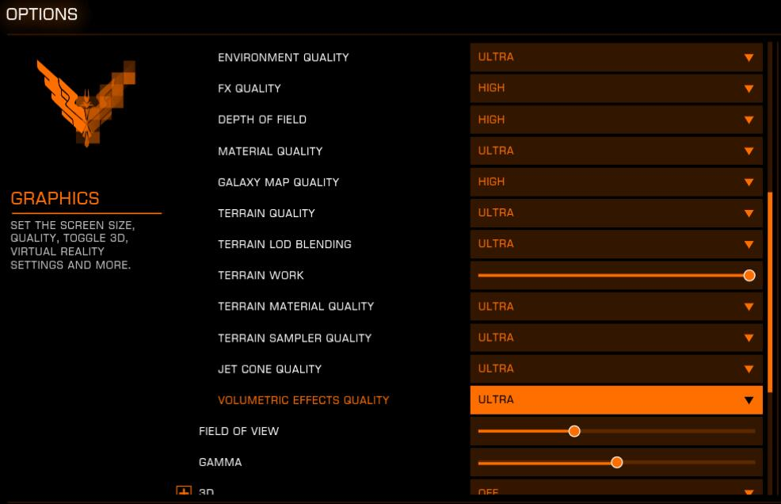

# EDAutopilot 
 - An autopilot bot for Elite:Dangerous based on OpenCV+Python.
 - Notice: this program **only** works in *Elite Dangerous: Horizons* currently
 - *Windows 11* Compatible

# What can it do?
 - Auto align with the displayed navigation circle
 - Run the Robigo Sightseeing mission unmanned with support for **full-automated** process  
Showcase: [here](https://streamable.com/p8mhoz) (*accelerated, no manual key input at all*)
 - Provide a gameSession API which you can write your own autonomous script, see [game.py](.vscode/game.py) for API reference.(examples on the way)
 - You can fork it as you wish to make changes

# Getting started
 1. Download the source code
 ```
 git clone https://github.com/Matrixchung/EDAutopilot.git
 ```
 1. Make sure you have applied the [Useful Settings](#useful-settings) (Best recommended, because I write this entire project in those settings)
 2. Run ```pip install -r .\requirements.txt``` to install all dependencies
 3. Go to .vscode folder and run the script robigo.py (For Robigo Sightseeing Mission, or you can write your own)
 ``` python ./robigo.py```
 5. When you are at Robigo Mines, **enter the starport menu and go to Passenger Lounge**, then simply click the Home button, and you can just sit back
 6. You can terminate the running process anytime when you click the End button. (Sometimes it may not kick in when in a sleep loop)
 7. You can leave the process unsupervised, but you should keep the mouse cursor on the Client Screen and manually takeover when it comes to interdict you
 8. See the [Variables](#variables) for any self-configurable variables

# Tips
 - In order not to get interdicted, you should only choose 'Low-value target' mission, which is displayed in the mission details. The other traits can be ignored cause we are in the 'Outpost' and won't be scanned.
 - Currently I'm annoyed at money-grabbing stuffs (for my Fleet Carrier), so currently this project will only play its role as a simple sightseeing mission bot. Given that I have already created a gameSession API, we can expect more features like multi-hop jumping assist for long distance travel etc. in the future. And if you want, you can fork it to do any modifications you want.

# Variables
- [robigo.py](.vscode/robigo.py)

    <table>
        <tr>
            <th>Variable</th>
            <th>Description</th>
            <th>Default</th>
        </tr>
        <tr>
            <th>isDebug</th>
            <th>Provides a useful debug window</th>
            <th>True</th>
        </tr>
        <tr>
            <th>showProcessedImg</th>
            <th>Show the extra compassImg and navPointImg for detailed debug</th>
            <th>True</th>
        </tr>
        <tr>
            <th>usingWatchDog</th>
            <th>Watchdog can help you force exit when being interdicted or attacked</th>
            <th>True</th>
        </tr>
        <tr>
            <th>stateOverride</th>
            <th>Manually start from the given state, especially after an unexpected exit</th>
            <th>(Empty)</th>
        </tr>
        <tr>
            <th>firstJumpDest</th>
            <th>Middle destination from Robigo to Sothis</th>
            <th>(based on ship)</th>
        </tr>
        <tr>
            <th>thirdJumpDest</th>
            <th>Middle destination from Sothis to Robigo</th>
            <th>(based on ship)</th>
        </tr>
        <tr>
            <th>maxMissionCount</th>
            <th>Max acceptable missions count, depending on your ship's cabin config</th>
            <th>8</th>
        </tr>
        <tr>
            <th>missionCountOverride</th>
            <th>For any unread missions or improper mission count 
            (e.g. former process is killed by watchdog, but newly-start game won't record any ongoing mission)</th>
            <th>0</th>
        </tr>
    </table>

# Useful Settings
 - Optimized Graphics Settings: 
     1. 1600x900 Windowed and in Primary Screen
	 2. 1920x1080 Desktop Resolution
     3. Detailed Graphics Settings:
        - 
        - 
        - 
        **I don't know whether I used some 3rd-party graphics quality patch(a long time ago), so the graphics may still be different from yours even if all in-game settings are correct. Feel free to make issue if you still encounter problems such as can't recognize some images etc.**
 - In-Game Settings:
     1. Set the Navigation Filter(in the first panel) to **ONLY STATIONS** and **POINTS OF INTEREST**
	 2. Bookmark **Sothis A 5** and **Robigo Mines** in the Galaxy Map, which means you have to run the mission yourself for at least once(to discover the destination planet), you can see [Sothis A 5](templates/robigo/map_sothis_a_5.png) and [Robigo Mines](templates/robigo/map_robigom.png) for example.
     3. Set the **INTERFACE BRIGHTNESS** to **Level 6-7** (in *Right Panel/4# Panel - SHIP - PILOT PREFERENCES*)
 - Robigo Mission preferred ship: Python https://s.orbis.zone/i1dm
 - Note for Robigo mission: whatever your ship is, make sure its jumping capability is enough to provide a **two-hop** route, which means only **one** middle destination for a single way.
 - FOV Setting: (YOUR_APPDATA_PATH/Local/Frontier Developments/Elite Dangerous/Options/Graphics/Settings.xml)
 ```<FOV>56.249001</FOV>```
 - Keybinds: (You can probably edit it in keybinds.py, but remember to apply them all manually to your **In-Game Settings**)
 ```python
 keysDict = {
    'YawLeftButton': 0x1E, # Key A
    'YawRightButton': 0x20, # Key D
    'PitchUpButton': 0xB5, # NUM /
    'PitchDownButton': 0x37, # NUM *
    'RollLeftButton': 0x4E, # NUM +
    'RollRightButton': 0x9C, # NUM ENTER
    'EnableFSD': 0x24, # Key J
    'EngineBoost': 0x0F, # Key Tab
    'Speed100': 0x47, # NUM 7
    'SpeedZero': 0x2D, # Key X
    'Speed50': 0x48, # NUM 8
    'ThrustUp': 0x13, # Key R
    'space': 0x39,
    'TargetAhead': 0x14, # Key T 
    'UI_OpenGalaxyMap': 0x4A, # NUM -
    'UI_NextTab': 0x12, # Key E
    'UI_PrevTab': 0x10, # Key Q
    'UI_Up': 0x11, # Key W
    'UI_Down': 0x1F, # Key S
    'UI_Left': 0x1E, # Key A
    'UI_Right': 0x20, # Key D
    'UI_1': 0x02, # Key 1
    'UI_2': 0x03, # Key 2
    'UI_3': 0x04, # Key 3
    'UI_4': 0x05, # Key 4
    'enter': 0x1C, # Key RETURN(ENTER)
    'esc': 0x01 # Key ESC
}
 ```
 - GUIColor Setting: (YOUR_STEAM_LIBRARY_PATH/steamapps/common/Elite Dangerous/Products/elite-dangerous-64/GraphicsConfiguration.xml)
 ```xml
 <GUIColour>
		<Default>
			<LocalisationName>Standard</LocalisationName>
			<MatrixRed>		0, 0.15, 1 </MatrixRed>
			<MatrixGreen>	0, 1, 0 </MatrixGreen>
			<MatrixBlue>	1, 0.04, 0.28 </MatrixBlue>
		</Default>
		<RedToBlueTest>
			<LocalisationName>RedToBlueTest</LocalisationName>
			<MatrixRed>		0, 0, 1 </MatrixRed>
			<MatrixGreen>	0, 1, 0 </MatrixGreen>
			<MatrixBlue>	1, 0, 0 </MatrixBlue>
		</RedToBlueTest>
		<DesaturateTest>
			<LocalisationName>DesaturateTest</LocalisationName>
			<MatrixRed>		0.33, 0.33, 0.33 </MatrixRed>
			<MatrixGreen>	0.33, 0.33, 0.33 </MatrixGreen>
			<MatrixBlue>	0.33, 0.33, 0.33 </MatrixBlue>
		</DesaturateTest>
	</GUIColour>
 ```

# Credits
 - **@skai2** https://github.com/skai2/EDAutopilot for initial idea and DirectInput system
